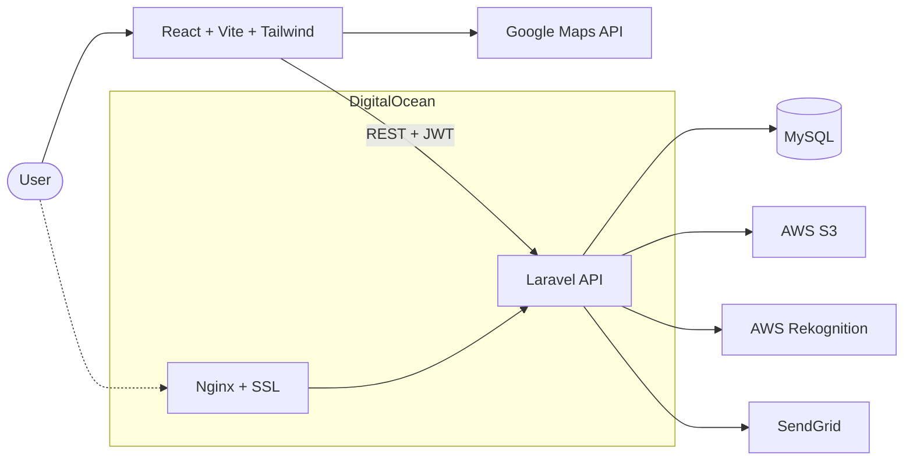
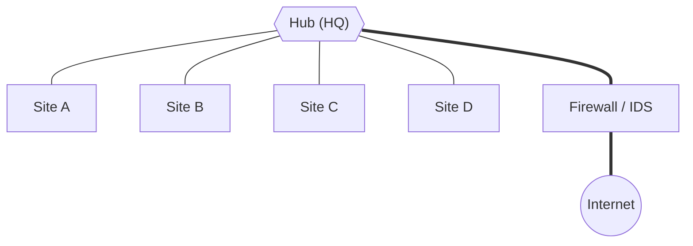

<!-- ═══════════════════════ HERO ═══════════════════════ -->


<div align="center">

[](https://git.io/typing-svg)

<br/>


<br/>

[<kbd> 📧 &nbsp;Email me </kbd>](mailto:alees2604@gmail.com)&nbsp;&nbsp;
[<kbd> 🐙 &nbsp;GitHub </kbd>](https://github.com/anferlleesugay)&nbsp;&nbsp;
[<kbd> 🚀 &nbsp;TierHome </kbd>](https://tierhome.live)

</div>

<br/>

<!-- ═══════════════════════ ABOUT ═══════════════════════ -->
<table>
<tr>
<td width="55%" valign="top">

### `~/about`

I'm a **BSIT student at National University** who builds real things end to end: a Laravel + React platform running in production, a Spring Boot AI app, and Android apps on the side.

When I'm not shipping features, I'm in a Packet Tracer or pfSense lab breaking and then hardening networks, or chasing flags on TryHackMe and HackTheBox.

**I like owning a project from the database schema to the SSL cert.**

</td>
<td width="45%" valign="top">

```yaml
name:      Anferl Lee Sugay
role:      Full-Stack Developer
school:    National University, BSIT
location:  Angeles City, PH 🇵🇭
experience: 1+ yr shipping production apps
languages: [English, Filipino]
focus:
  - Laravel + React
  - Networking
  - Ethical hacking
status:    open to junior roles ✅
```

</td>
</tr>
</table>

<br/>

<!-- ═══════════════════════ STACK ═══════════════════════ -->
## `~/stack`

<div align="center">

| | |
|:--:|:--|
| **🖥️ Frontend** |  |
| **⚙️ Backend** |  |
| **🗄️ Data** |  |
| **☁️ Cloud & Infra** |  |
| **📱 Mobile** |  |
| **🧰 Workflow** |  |

</div>

<details>
<summary><b>🔍 How I actually use each layer</b></summary>
<br/>

| Layer | Tools | What I do with them |
|:--|:--|:--|
| **Web frontend** | React · Vite · Tailwind · Next.js | Role-based routing, dashboards, responsive UIs |
| **Web backend** | Laravel · PHP · JWT · Node/Express | REST APIs, authentication, email delivery via SendGrid |
| **Java** | Spring Boot | REST API for Votelligence, my AI poll app |
| **Data** | MySQL · PostgreSQL · Firebase | Relational models, real-time sync |
| **Cloud & AI** | AWS S3 · AWS Rekognition · Google Maps API | Face collections, image storage, location features |
| **Deployment** | DigitalOcean · Nginx · SSL | Server setup and live production hosting |
| **Mobile** | Flutter · Kotlin · Firebase | Cross-platform and native Android apps |
| **Design** | Figma · Postman · Jira | Mockups, API testing, sprint tracking |

</details>

<br/>

<!-- ═══════════════════════ PROJECTS ═══════════════════════ -->
## `~/projects`

<table>
<tr>
<td width="50%" valign="top">

### 🏠 TierHome
`CAPSTONE · LIVE`

A housing **decision-support platform for Angeles City**. It began as a Flutter/Firebase app that ranked affordable housing by a 30%-of-income rule, then grew into a full web platform.


[**🔗 tierhome.live →**](https://tierhome.live)

</td>
<td width="50%" valign="top">

### 🗳️ Votelligence
`IN PROGRESS`

An **AI-augmented poll and voting app**: poll generator, sentiment analysis, summaries, and duplicate-poll detection using embeddings.


</td>
</tr>
<tr>
<td width="50%" valign="top">

### 🛒 NuBullStocks
`FEB 2024 · ANDROID`

Shopping app for browsing products, managing carts and placing pre-orders, with an **admin dashboard** for inventory and notifications.


</td>
<td width="50%" valign="top">

### 🏫 Campus Network Expansion
`SIMULATION · NATIONAL UNIVERSITY`

A **five-site campus network** with VLANs, trunking, and static/default routing, built and tested in Cisco Packet Tracer.


</td>
</tr>
</table>

<details>
<summary><b>🧩 TierHome architecture at a glance</b></summary>
<br/>



</details>

<br/>

<!-- ═══════════════════════ SECURITY LAB ═══════════════════════ -->
## `~/security-lab`

<div align="center">


</div>

<br/>

<table>
<tr>
<td width="50%" valign="top">

```text
┌─ ROUTING & SWITCHING ──────────────┐
│ VLSM · VLANs · Trunking · OSPF     │
├─ PERIMETER ────────────────────────┤
│ Zone-Based Firewalls · pfSense     │
├─ SECURE TUNNELS ───────────────────┤
│ GRE · IPsec VPNs                   │
├─ MONITORING & ACCESS ──────────────┤
│ Suricata IDS · Syslog · AAA/RADIUS │
└────────────────────────────────────┘
```

</td>
<td width="50%" valign="top">



<sub>Multi-site hub-and-spoke design</sub>

</td>
</tr>
</table>

<br/>

<!-- ═══════════════════════ LEARNING ═══════════════════════ -->
## `~/currently-learning`

| Track | Focus | Status |
|:--|:--|:--|
| ☕ **Backend & APIs** | freeCodeCamp Back End Development |  |
| 🌱 **Java & Spring Boot** | Building Votelligence's REST API |  |
| 🏛️ **Software architecture** | Designing systems that scale |  |
| 🌐 **IPv6** | Subnetting and addressing |  |
| 🏴 **Ethical hacking** | TryHackMe and HackTheBox |  |

<br/>

<!-- ═══════════════════════ STATS ═══════════════════════ -->
## `~/stats`

<div align="center">


</div>

<br/>

<!-- ═══════════════════════ CONTACT ═══════════════════════ -->
<div align="center">

### 🤝 Let's build something

*Open to junior full-stack roles and freelance work.*

[](mailto:alees2604@gmail.com)
[](https://github.com/anferlleesugay)

</div>


