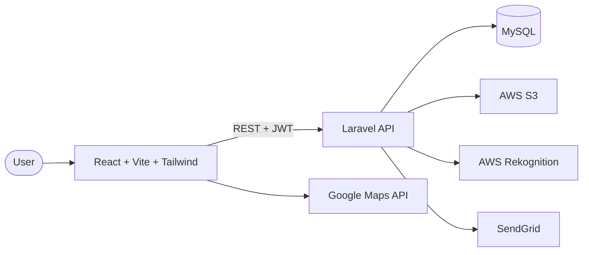

# Anferl Lee Sugay

**Full-Stack Developer · Networking · Cybersecurity**
BS Information Technology, National University · Angeles City, Philippines

---

## About

Junior full-stack developer with over a year of hands-on experience building and deploying a real estate web platform with **Laravel** and **React**. I design REST APIs, implement role-based authentication, and ship responsive interfaces. Outside of application work, I build and secure networks (VLANs, IPsec VPNs, firewalls) and practice ethical hacking.

I'm open to junior full-stack roles and freelance work.

---

## Technical Skills

| Area | Technologies |
|:--|:--|
| **Frontend** | React, Vite, Next.js, Tailwind CSS, JavaScript, HTML, CSS |
| **Backend** | Laravel, PHP, Spring Boot (Java), Node.js, Express, JWT |
| **Databases** | MySQL, PostgreSQL, Firebase |
| **Cloud & Deployment** | AWS S3, AWS Rekognition, DigitalOcean, Nginx, SSL |
| **Mobile** | Flutter, Dart, Kotlin, Android Studio |
| **Networking & Security** | Cisco Packet Tracer, pfSense, Suricata, VLANs, OSPF, IPsec, GRE, AAA/RADIUS |
| **Tools** | Git, GitHub, Postman, Figma, Jira |

---

## Selected Projects

### TierHome — Capstone
Housing decision-support platform for Angeles City. It began as a Flutter and Firebase app that ranked affordable housing using a 30%-of-income rule, then grew into a full web platform with role-based access, image verification, and map-based search.

`React` `Vite` `Tailwind CSS` `Laravel` `MySQL` `AWS Rekognition` `AWS S3` `Google Maps API` `SendGrid`

Architecture

 

### Votelligence — In Progress
AI-augmented poll and voting application featuring an AI poll generator, sentiment analysis, result summaries, and duplicate-poll detection using embeddings.

`React` `Spring Boot` `PostgreSQL`

### NuBullStocks — Android App
Shopping app for browsing products, managing carts, and placing pre-orders, with an admin dashboard for inventory management and notifications.

`Kotlin` `Android Studio` `Firebase`

### Campus Network Expansion — Simulation
Five-site campus network for National University designed in Cisco Packet Tracer, using VLANs, trunking, and static and default routing.

`Cisco Packet Tracer` `VLANs` `Trunking` `Static Routing`

---

## Networking & Security

- **Routing and switching:** VLSM, VLANs, trunking, OSPF
- **Perimeter security:** zone-based firewalls, pfSense
- **Secure tunnels:** GRE and IPsec VPNs
- **Monitoring and access control:** Suricata IDS, Syslog, AAA/RADIUS
- **Architecture:** multi-site hub-and-spoke designs
- **Practice:** TryHackMe and HackTheBox

---

## Currently Learning

- Back-end development and APIs (freeCodeCamp)
- Java and Spring Boot
- Software architecture
- IPv6 subnetting

---

## GitHub Activity

---

## Contact

📧 [alees2604@gmail.com](mailto:alees2604@gmail.com) · 🐙 [github.com/anferlleesugay](https://github.com/anferlleesugay)
