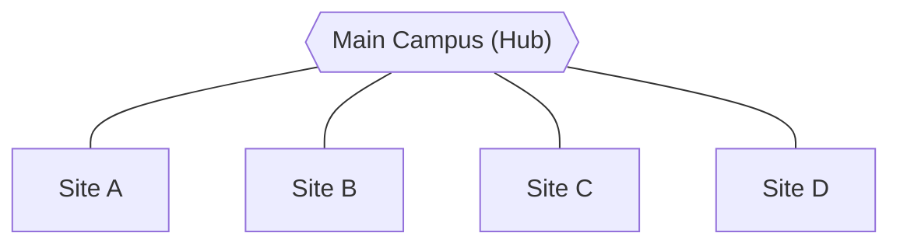

# Anferl Lee Sugay

### Full-Stack Developer &nbsp;|&nbsp; Network Engineer in Training &nbsp;|&nbsp; Cybersecurity Enthusiast

BS Information Technology, National University &nbsp;·&nbsp; Angeles City, Philippines

*Open to junior full-stack roles and freelance work*

---

## Profile

Junior full-stack developer with over a year of experience building and deploying a real estate web platform using **Laravel** and **React**. I design REST APIs, implement role-based authentication, and ship responsive interfaces. My networking and security background (VLANs, IPsec VPNs, firewalls, intrusion detection) lets me think about the whole system: how it is built, how it is connected, and how it is protected.

---

## Core Competencies

<table>
<tr>
<th width="33%" align="center">💻 Full-Stack Development</th>
<th width="33%" align="center">🌐 Networking</th>
<th width="33%" align="center">🛡️ Cybersecurity</th>
</tr>
<tr>
<td valign="top">

- REST API design and development
- Role-based authentication with JWT
- Responsive React interfaces
- Relational data modeling
- Cloud storage and image recognition
- Server setup, Nginx, SSL

</td>
<td valign="top">

- VLSM, VLANs, and trunking
- OSPF, static and default routing
- GRE and IPsec VPN tunnels
- Multi-site hub-and-spoke design
- AAA with RADIUS, Syslog
- Cisco Packet Tracer simulations

</td>
<td valign="top">

- Zone-based firewalls and pfSense
- Suricata intrusion detection
- Ethical hacking practice labs
- TryHackMe and HackTheBox
- Secure authentication patterns
- Network perimeter design

</td>
</tr>
<tr>
<td align="center">

</td>
<td align="center">

</td>
<td align="center">

</td>
</tr>
</table>

---

## Technology Stack

| Domain | Technologies |
|:--|:--|
| **Frontend** |      |
| **Backend** |      |
| **Database** |    |
| **Cloud & DevOps** |    |
| **Mobile** |     |
| **Network & Security** |      |
| **Tools** |      |

---

## Featured Work

### 🏠 TierHome &nbsp;·&nbsp; Capstone Project
*Full-stack web platform*

A housing decision-support platform for Angeles City. It started as a Flutter and Firebase app that ranked affordable housing using a 30%-of-income rule, then grew into a full web platform with role-based access, image verification, and map-based search. Deployed and tested on a DigitalOcean server with Nginx and SSL.

**Stack:** React · Vite · Tailwind CSS · Laravel · MySQL · AWS S3 · AWS Rekognition · Google Maps API · SendGrid

<b>View system architecture</b>

 

### 🗳️ Votelligence &nbsp;·&nbsp; In Progress
*AI-powered full-stack application*

A poll and voting app that generates polls with AI, analyzes sentiment, summarizes results, and detects duplicate polls using embeddings.

**Stack:** React · Spring Boot · PostgreSQL

### 🛒 NuBullStocks &nbsp;·&nbsp; February 2024
*Native Android application*

A shopping app for browsing products, managing carts, and placing pre-orders, with an admin dashboard for inventory and notifications.

**Stack:** Kotlin · Android Studio · Firebase

### 🏫 Campus Network Expansion &nbsp;·&nbsp; Simulation
*Enterprise network design*

A five-site campus network for National University built in Cisco Packet Tracer, using VLANs, trunking, and static and default routing.

<b>View topology concept</b>

 

---

## Security Lab

| Layer | Focus |
|:--|:--|
| **Perimeter** | Zone-based firewalls, pfSense |
| **Encryption** | GRE and IPsec VPN tunnels |
| **Detection** | Suricata IDS, Syslog |
| **Access control** | AAA with RADIUS |
| **Offensive practice** | TryHackMe rooms, HackTheBox machines |

---

## Currently Learning

| Topic | Focus |
|:--|:--|
| **Back-end development** | APIs, freeCodeCamp curriculum |
| **Java & Spring Boot** | REST services for Votelligence |
| **Software architecture** | Designing maintainable systems |
| **IPv6** | Subnetting and addressing |
| **Ethical hacking** | Ongoing practice on TryHackMe and HackTheBox |

---

## GitHub Activity

---

### Let's work together

I'm available for junior full-stack roles and freelance projects.

